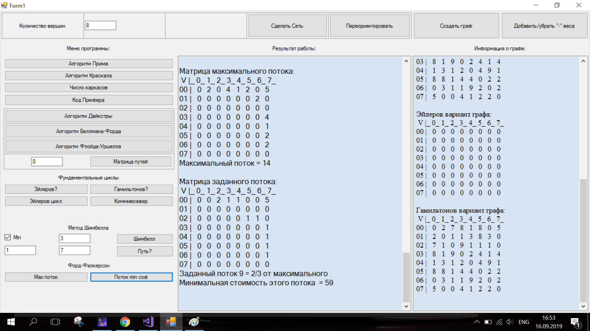

# Алгоритмы теории графов

Решаемые задачи
=================

Сформировать случайным образом связный ациклический граф в соответствии
с биномиальным распределением. На получившемся графе:

​1) Реализовать метод Шимбелла (пользователь вводит количество ребер);

​2) Определить возможность построения маршрута от одной заданной точки
до другой (вершины вводит пользователь);

​3) Найти кратчайший путь от одной точки к другой, используя алгоритмы
Дейкстры, Беллмана-Форда, Флойда (пользователь вводит номер вершины).
Сравнить скорости работы данных алгоритмов по итерациям;

​4) Построить минимальный по весу остов, используя алгоритмы Прима и
Краскала. Сравнить данные алгоритмы по итерациям. Полученный остов
закодировать с помощью кода Прюфера (проверить правильность кодирования
декодированием).

​5) Используя матричную теорему Кирхгофа, найти число остовных деревьев;

​6) Построить матрицы пропускных способностей и стоимости;

​7) Найти максимальный поток по алгоритму Фалкерсона;

​8) Вычислить поток минимальной стоимости (в качестве величины потока
брать значение, равное [2/3\*max], где max – максимальный поток).
Использовать ранее реализованные алгоритмы Дейкстры и Беллмана – Форда;

9). Проверить, является ли граф эйлеровым и гамильтоновым. Если граф не
является таковым, то отдельно модифицировать граф до эйлерова и отдельно
до гамильтонова (до полного графа можно дополнять только в крайнем
случае!);

​10) Построить эйлеров цикл.

​11) Решить задачу коммивояжера на гамильтоновом графе (все гамильтоновы
циклы с суммарным весом выводим либо на экран, если их мало, либо в
файл).

Пример работы программы
=======================

На следующих скриншотах (Рис: 4 - 13) представленырезультаты работы
программы.

При запуске программы появляется стартовое окно.

После заполнения поля с количеством вершин и нажатия на кнопку “Создать
граф” в правом окне появляются параметры сгенерированного графа, а
влевом результат работы программы.

Далее, можно несколько модифицировать граф. Например, из
ориентированного графа сделать неориентированный.

Или добавить отрицательные веса. Их удаление из графа происходит по
нажатию той же кнопки.

Вывод величин кратчайших путей по алгоритмам Дейкстры, Беллмана-Форда,
Флойда-Уоршелла. Происходит по нажатиям соответствующих кнопок.

Нахождение остовных деревьев минимального веса по алгоритмам Прима и
Краскала. Также кодирование и декодирование получившехся остовов с
помощью кода Профера. Подсчет общега числа остовных деревьев по теореме
Кирхгофа.

Создание сети из графа. Происходит по нажатию кнопки “Сделать Сеть”.
Создается матрица пропускных способностей. Это также параметр графа,
потому выводится в правом окне.

 

Нахождение максимального потока по алгоритму Форда-Фалкерсона и потока
минимальной стоимости. Происходит по нажатию соответсвующих кнопок “Мах
поток” и “потоко min cost”.

Проверка - является ли граф эйлеровым и гамильтоновым. Достраивание
отдельно о эйлерова, отдельно до гамильтонова. Результат также выводится
справа, так как эйлеров вариант графа и гамильтонов вариант графа
являются параметрами графа, то они также выводятся справа. Поиск
эйлерова и гамильтонова цикла минимального веса (задача коммивояжера).
Все происходит по нажатию соответствующих кнопок слева.

Метод Шимбелла и достижимость вершин.

Масштабирование, достоинства и недостатки
=========================================

#### Масштабирование

– Оптимизировать работу с матрицами (вычисление определителя).

– Заменить полный перебор в задаче коммивояжера эвристическим алгоритмом
(например, метод ветвей и границ).

– Добавить отрисовку графа для лучшего восприятия.

#### Достоинства

– Наличие кнопочного пользовательского интерфейса.

– Сообщения с подсказками действий в случае ошибки.

– Наличие отдельного окна с параметрами графа.

– Сохранение параметров и модификаций графа в самом классе для
дальнейшего использования.

– Результаты задачи коммивояжера сохраняются в отдельный файл.

#### Недостатки

– Для n => 15 алгоритм решения задачи коммивояжера практически не
применим.

– Отсутствие визуализации графа.

– При кодировании кодом Прюфера не сохраняются веса ребер.

Математическое описание
=======================

Генерация графа
---------------

Степени вершин графа должны подчиняться биномиальному распределению.

### Биномиальное распределение

Генерация чисел, соответсвующих биномиальному распределению в заданном
диапазоне от 0 до n происходит следующим образом: берется число от 0 до
1 - р - вероятность успеха выпадения нужного числа (от этой величины
зависит плотность графа). С помощью нормального распредления
генерируется случайное число от 0 до 1. Если оно лежит в диапазоне от 0
до p, то берем текущее значение генерируемой величины, иначе прибавляем
к ней 1, пересчитываем p как $ p = pc (n + 1 - x) / x$, где
$ c = \frac{p}{1 - p}$ и снова генерируем случайное число от 0 до 1.
Повторяем, пока не сгенерируем нужное количество.

[h]0.4 ![Алгоритм генерации
величины.]
 

[h]0.4 ![Функция вероятности биномиального распределения с
параметром 0.4.]
 

![Полученное распределение.]

Экстремальные пути на графах
----------------------------

### Метод Шимбелла

С помощью этого метода определяется наличие на графе экстремальных путей
с заданным количеством ребер и их вес.

Введем, следуя Шимбеллу, специальные операции над элементами матрицы
смежности вершин:

​1) Операция умножения двух величин a и b при возведении матрицы в
степень соответствует их алгебраической сумме, то есть

$$\begin{cases}
            a \cdot b = b \ cdot a \Longrightarrow a + b = b + a\\
            a \cdot 0 = 0 \cdot a \Longrightarrow a + 0 = 0 + a = 0 
        \end{cases}$$

​2) Операция сложения двух величин a и b заменяется выбором из этих
величин минимального (максимального) элемента, то есть

$ a + b = b + a \Longrightarrow \text{min(max)} \{a, b\}$

нули при этом игнорируются. Минимальный или максимальный элемент
выбирается из ненулевых элементов. Нуль в результате даной операции
может быть получен лишь тогда, когда все элементы из выбираемых –
нулевые.\

**Пример:** Определение веса максимальных путей длиной 2\

$
        \Omega = \left(\begin{array}{cccc}
            0 & 1 & 0 & 2\\
            2 & 0 & 2 & 0\\
            3 & 0 & 0 & 0\\
            0 & 2 & 1 & 0
        \end{array} \right)
    $ $
        \Omega^2 = \left(\begin{array}{cccc}
            0 & 1 & 0 & 2\\
            2 & 0 & 2 & 0\\
            3 & 0 & 0 & 0\\
            0 & 2 & 1 & 0
        \end{array} \right) 
        \left(\begin{array}{cccc}
            0 & 1 & 0 & 2\\
            2 & 0 & 2 & 0\\
            3 & 0 & 0 & 0\\
            0 & 2 & 1 & 0
        \end{array} \right) 
        = 
        \left(\begin{array}{cccc}
            3 & 4 & 3 & 0\\
            0 & 2 & 5 & 4\\
            0 & 0 & 0 & 0\\
            4 & 0 & 4 & 0
        \end{array} \right) 
    $ , где\

$ \omega_{1,1} = 0 \cdot 0 + 1 \cdot 2 + 0 \cdot 3 + 2 \cdot 0 \to \text{max}\{0 + 0, 1 + 2, 0 + 3, 2 + 0\} = 3$\
$ \omega_{1,2} = \text{max}\{0 + 1, 1 + 0, 0 + 0, 2 + 2\} = 4$\
$ \omega_{1,3} = \text{max}\{0 + 0, 1 + 2, 0 + 0, 2 + 1\} = 3$ и т.д.\

### Достижимость вершин

Наличие пути от одной вершины до другой определяется при помощи
алгоритма Шимбелла. Матрица смежности, при помощи метода, описанного
пунктом выше, возводится в степень от 1 до р (количество вершин). Если
хоть на одной из итереций нужные вершины оказываются достижимыми, то
алгоритм возвоащает положительный результат.

### Алгоритм Дейкстры

Дан взвешенный ориентированный граф G(V,E) без дуг отрицательного веса.
Найти величины кратчайших путей от вершины s графа G до всех остальных
вершин этого графа.

Каждой вершине из V сопоставим метку — минимальное известное расстояние
от этой вершины до s. На каждом шаге алгоритма посещается одна вершина и
происходит попытка уменьшить метки. Работа алгоритма завершается, когда
все вершины посещены.

Метка самой вершины s полагается равной 0, метки остальных вершин —
бесконечности (расстояния до других вершин пока неизвестны). Все вершины
графа помечаются как непосещённые.

Этап 1. Если все вершины посещены, алгоритм завершается. В противном
случае, из ещё не посещённых вершин выбирается вершина u, имеющая
минимальную метку. Мы рассматриваем всевозможные маршруты, в которых u
является предпоследним пунктом. Вершины, в которые ведут рёбра из u,
назовём соседями этой вершины. Для каждого соседа вершины u, кроме
отмеченных как посещённые, рассмотрим новую длину пути, равную сумме
значений текущей метки u и длины ребра, соединяющего u с этим соседом.
Если полученное значение длины меньше значения метки соседа, заменим
значение метки полученным значением длины. Рассмотрев всех соседей,
пометим вершину u как посещённую и повторим этот этап алгоритма.

Алгоритм принадлежит к семейству жадных алгоритмов. Сложность $O(n)$.
При нахождении самого пути следует проделать еще один этап:

Выбираем вершину t - конечная вершина пути.

2-ой этап алгоритма. Выполняется оследовательный поиск дуг кратчайшего
пути. x’ = t. Среди вершин, непосредственно предшествующих вершине x’ с
постоянными метками, находим вершину $x_i$ , удовлетворяющую соотношению
d(x’) = d( $x_i$) $+\omega( x_i, x')$. Включаем дугу $( x_i, x')$ в
искомый путь и полагаем x’ = $x_i$. Проверка на завершение второго шага.
Если x’ = s, то кратчайший путь найден – его образует последовательность
дуг, полученных данном шаге и выстроенных в обратном порядке. В
противном случае шаг повторяется.

Сложность алгоритма при этом вырастает до $O(n^2)$.

### Алгоритм Беллмана-Форда

Дан взвешенный ориентированный граф G(V,E). Важно: в графе не должно
быть циклов отрицательного веса. Найти величины кратчайших путей от
вершины s графа G до всех остальных вершин этого графа.

Как и в алгоритме Дейкстры всем вершинам приписываются метки
корректирующиеся так: d($x_i$) = min(d($x_i$), d(x’)
$+ \omega(x', x_i)$. Также состоит из 2-х этапов.

Этап 1: нахождения длин кратчайших путей от вершины s до всех остальных
вершин графа. Шаг 1. Присвоение начальных значений.
$d(s) = 0, d(x_i) = \infty, x' = s,  Q = {x'}$

Шаг 2. Корректировка меток. Корректировка очереди: Если вершина $x_i$
небыла в очереди и неходится в ней в данный момент, то ставим ее в
конец, иначе в начало.

Шаг 3. Если $Q \neq \emptyset$, то возвращаемся к началу второго шага,
иначе первый этап закончен.

Второй этап совпадает со вторым этапом алгоритма Дейкстры.

Данный алгоритм является алгоритмом динамического программирования.
Сложность $O(pq)$, где р - количество вершин, а q - количество ребер.

### Алгоритм Флойда-Уоршелла

Дан взвешенный ориентированный граф G(V,E). Важно: в графе не должно
быть циклов отрицательного веса. Найти величины кратчайших путей от всех
вершин графа G до всех вершин этого графа (на выходе матрица).

Пусть D - матрица смежности и каждому ее элементу $d_{ij}$ присвоен вес
ребра. По мере выполнения алгоритма данная матрица будет
перезаписываться: в каждую из ее ячеек занесется значение кратчайше
длины пути из i в j.

$d_{ij}^{k}$ - длина кратчайшего пути от i до j, который кроме самих
вершин i, j проходит только через вершины 1…k. Очевидно, что
$d_{ij}^{0}$ — длина (вес) ребра(i, j), если таковое существует (в
противном случае его длина может быть обозначена как $\infty$ ).

Существует два варианта значения $d_{ij}^{k}\in (1, \ldots, n)$:

​1) Кратчайший путь между i, j не проходит через вершину k, тогда
$d_{ij}^{k} = d_{ij}^{k-1}$ 2) Существует более короткий путь между i,
j, проходящий через k, тогда он сначала идёт от i до k, а потом от k до
j. В этом случае, очевидно, $ d_{ij}^{k}=d_{ik}^{k-1}+d_{kj}^{k-1}$
Таким образом, для нахождения значения функции достаточно выбрать
минимум из двух обозначенных значений.

Тогда рекуррентная формула для $d_{ij}^{k}$ имеет вид:

$d_{ij}^{0}$ — длина ребра$(i,j)$;

$d_{ij}^{k}=\min(d_{ij}^{k-1}, d_{ik}^{k-1}+d_{kj}^{k-1})$.

Алгоритм Флойда-Уоршелла последовательно вычисляет значения
$d_{ij}^{k}$, $\forall i, j$ для k от 1 до n. Итоговые значения
$d_{ij}^{n}$ являются длинами кратчайших путей между вершинами i, j.

Сложность алгоритма $O(n^3)$.

Построение остовных деревьев
----------------------------

Остовное дерево графа состоит из минимального подмножества рёбер графа,
таких, что из любой вершины графа можно попасть в любую другую вершину,
двигаясь по этим рёбрам.

### Алгоритм Прима

На вход алгоритма подаётся связный неориентированный граф G(V,E). Для
каждого ребра задаётся его стоимость.

Сначала берётся произвольная вершина и находится ребро, инцидентное
данной вершине и обладающее наименьшей стоимостью. Найденное ребро и
соединяемые им две вершины образуют дерево. Затем, рассматриваются рёбра
графа, один конец которых — уже принадлежащая дереву вершина, а другой —
нет; из этих рёбер выбирается ребро наименьшей стоимости. Выбираемое на
каждом шаге ребро присоединяется к дереву. Рост дерева происходит до тех
пор, пока не будут исчерпаны все вершины исходного графа.

Результатом работы алгоритма является остовное дерево минимальной
стоимости.

Сложность алгоритма $O(n \log n)$.

### Алгоритм Краскала

В начале текущее множество рёбер устанавливается пустым. Затем, пока это
возможно, проводится следующая операция: из всех рёбер, добавление
которых к уже имеющемуся множеству не вызовет появление в нём цикла,
выбирается ребро минимального веса и добавляется к уже имеющемуся
множеству. Когда таких рёбер больше нет, алгоритм завершён.

До начала работы алгоритма необходимо отсортировать рёбра по весу.

Сложность алгоритма (из-за сортировки ребер) $O(n \log n)$.

### Матричная теорема Кирхгофа

Пусть G — связный помеченный граф с матрицей Кирхгофа К. Все
алгебраические дополнения матрицы Кирхгофа К равны между собой и их
общее значение равно количеству остовных деревьев графа G.

матрица Кирхгофа $K=(k_{i,j})_{n\times n}$ данного графа будет
определяться следующим образом:

$ k_{i,j}:={
            \begin{cases}
                \deg(v_{i})& \text{при} i=j,\\
                -1 & \text{при} (v_{i},v_{j}) \in E(G),\\
                0 & \text{в противном случае}.
            \end{cases}}$

### Код Прюфера

Однозначно сопоставляет произвольному конечному дереву
последовательность: дереву с n вершинами сопоставляется
последовательность из n-2 чисел от 1 до n с возможными повторениями.

#### Построение

Пусть T есть дерево с вершинами, занумерованными числами
$\{1,2,\dots ,n\}$. Построение кода Прюфера дерева T ведётся путем
последовательного удаления вершин из дерева, пока не останутся только
две вершины. При этом каждый раз выбирается концевая вершина с
наименьшим номером и в код записывается номер единственной вершины, с
которой она соединена. В результате получаем последовательность
$(p_{1},\dots ,p_{n-2})$, составленную из чисел $\{1,2,\dots,n\}$,
возможно с повторениями.

#### Восстановление дерева

Для восстановления дерева по коду $p=(p_{1},\dots ,p_{n-2})$, заготовим
список номеров вершин $s=(1,\dots ,n)$. Выберем первый номер $i_1$,
который не встречается в коде. Добавим ребро $(i_{1},p_{1})$, после
этого удалим $i_1$ из s и $p_{1}$ из p.

Повторяем процесс до момента, когда код p становится пустым. В этот
момент список s содержит ровно два числа $i_{n-1}$ и n. Остаётся
добавить ребро $(i_{n-1},n)$, и дерево построено.

Потоки в сетях
--------------

### Алгоритм Фалкерсона

**Теорема Форда-Фалкерсона:** для любой сети с одним источником и одним
стоком величина максимального потока в сети равна пропускной способности
минимального разреза.

Дан граф (сеть) G(V,E) с пропускной способностью c(u,v) и потоком
f(u,v)=0 для рёбер из u в v. Необходимо найти максимальный поток из
источника s в сток t. На каждом шаге алгоритма действуют те же условия,
что и для всех потоков:

$f(u,v)\leqslant c(u,v)$. Поток из u в v не превосходит пропускной
способности.

$f(u,v)=-f(v,u)$.

$\sum _{v}f(u,v)=0\Longleftrightarrow f_{{in}}(u)=f_{{out}}(u)$ для всех
узлов u, кроме s и t. Поток не изменяется при прохождении через узел.\

Остаточная сеть $G_{f}(V,E_{f})$ — сеть с пропускной способностью
$c_{f}(u,v)=c(u,v)-f(u,v)$ и без потока.

Вход: Граф G с пропускной способностью c, источник s и сток t

Выход: Максимальный поток f из s в t

​1) $f(u,v):=0$ для всех рёбер (u,v)

​2) Пока есть путь p из s в t в $G_f$, такой что $c_{f}(u,v)>0$ для всех
рёбер $(u,v)\in p$:

​1. Найти $ c_{f}(p)=\min\{c_{f}(u,v)\;|\;(u,v)\in p\}$

​2. Для каждого ребра $(u,v)\in p$

$f(u,v):=f(u,v)+c_{f}(p)$

$f(v,u):=f(v,u)-c_{f}(p)$\

Сложность алгоритма $O(qf)$, где q — число рёбер в графе, f —
максимальный поток в графе.

### Поток минимальной стоимости

Дан граф (сеть) G(V,E) с пропускной способностью c(u,v) для рёбер из u в
v и некоторая величина потока $k$. Требуется найти поток этой величины с
наименьшей стоимостью.

Т.е. минимизировать целевую функцию
$\sum\limits_{(u,v) \in V}\omega(u,v) \cdot f(u, v) \rightarrow min$

Если р - кратчайший путь (по матрице стоимости. Находим по алгоритму
Дейкстры) от s к t в сети, $с_{min}(р)$ - минимальная из пропускных
способностей дуг входящих в путь р, и если $k < с_{min}(р)$, то задача
решена. Весь поток направляется вдоль данного пути. Общее решение задачи
строится следующим образом: Сначала находится кратчайший путь от s к t в
сети и величина максимального потока по данному пути $\phi_{max}$(по
алгоритму Форда-Фалкерсона). Если $k < \phi_{max}$, то задача решена. В
противом случае сеть модифицируютспециальным образом и все повторяется.

Сложность алгоритм составляет O(knq)

Фундаментальные циклы
---------------------

### Эйлеров цикл

Эйлеров граф - граф, содержащий эйлеров цикл.

Эйлеров цикл - цикл, содержащий все ребра графа.

#### Определение является ли граф эйлеровым

Граф эйлеров тогда и только тогда, когда каждая вершина имеет чётную
степень.

#### Построение эйлерова графа

Добавляем в произвольный граф ребра между нечетными вершинам до тех пор,
пока все вершины не станут чётными. Если нечетные вершины уже смежны,то
удаляем ребро, если это не мост.

#### Построение эйлерова цикла

Начав с произвольной вершины v, строим путь, удаляя рёбра и запоминая
вершины в стеке, до тех пор, пока множество смежности очередной вершины
не окажется пустым, что означает, что путь удлинить нельзя. Заметим, что
при этом мы с необходимостью придём в ту вершину, с которой начали. В
противном случае вершина v имеет нечётную степень, что невозможно по
условию. Таким образом, из графа были удалены рёбра цикла, а вершины
цикла были сохранены в стеке. Заметим, что при этом степени всех вершин
остались чётными. Далее вершина v выводится в качестве первой вершины
эйлерова цикла, а процесс продолжается с вершины, стоящей на вершине
стека.

### Гамильтонов цикл

Гамильтонов граф - граф, содержащий гамильтонов цикл.

Гамильтонов цикл - простой цикл, содержащий все вершины графа по одному
разу.

#### Определение является ли граф гамильтоновым

Простые необходимые и достаточные условия гамильтоновости графа
неизвестны. Известны только некоторые достаточные условия. В данной
работе использовась теорема Дирака:

Если $p(G) >= 3 ~~\text{и}~~ \delta(G) >= p/2$, то граф G является
гамильтоновым.

#### Построение гамильтонова графа

Любой граф G можно превратить в гамильтонов, добавив достаточное
количество новых рёбер между неинцидентными вершинами.

#### Задача коммивояжёра

Коммивояжер должен посетить N городов, побывав в каждом из них ровно по
одному разу и завершив путешествие в том городе, с которого он начал.
Требуется найти последовательность обхода городов, при которой общая
длина пути была бы наименьшей.

Таким образом, задача представляет собой поиск гамильтонова цикла
минимального веса, т.е. минимизировать целевую функцию
$\sum\limits_{i = 1}^n \sum\limits_{j = 1}^n \omega(v_i, v_j) \cdot \chi_{i,j} \rightarrow min$,
где $\omega(v_i, v_j)$ - расстояние между городом i и городом j (вес
ребра), $\chi_{i,j} = {
        \begin{cases}
        1& \text{если переезд из города i в город j входит в маршрут} ,\\
        0 & \text{в противном случае}.
        \end{cases}}$\

Задача коммивояжёра относится к классу NP-трудных и не известен
алгоритм, который позволет гарантировано её решить за полиномиальное по
числу городов N время.

В данной работе был выбран метод “полного перебора”: генерируется все
перестановки N вершин и считается длина получившегося пути. Выбирается
путь с наименьшей длиной.

Сложность данного алгоритма $O(n!)$. Практически бесполезен при $N > 15$

Особенности реализации
======================

Все методы и алгоритмы были реализованы в одной программе, написанной на
С$\sharp$.

Пользовательский интерфейс
--------------------------

Программа реализована в виде приложения Windows Forms. Все элементы
интерфейса являются стандартами элементами Windows Forms.

Шапка окна состоит из кнопок **свернуть**, **развернуть** и **закрыть**.

В окне элементы интерфейса сгруппированы при помощи системы панелей
TableLayoutPanel.

Верхняя строка содержит кнопки и поля ввода для управления графом: поле
ввода количества вершин и 4 кнопки - **Создать граф**, **Добавить
$\backslash$ Убрать отрицательные веса**, **Переориентировать**,
**Сделать сеть**.

Ниже идут 3 колонки. Левая колонка представляет собой набор различных
кнопок и полей ввода для соответсвующих алгоритмов (см. особенности
реализации каждого конкретно). Центральная колонка представляет собой
окно вывода **Результаты работы**, являющееся элементов типа
многострочного TextBox. Работает по принципу консоли или лога, т.е.
отображает все результаты работы приложения. Правая колонка также
представляет собой окно вывода **Информация о графе**, являющееся
элементов типа многострочного TextBox. Отображает информацию о графе
(тип графа, количество ребер/дуг, сами ребра/дуги и их веса, а также
матрицу смежности).

Каждое нажатие на кнопку генерирует событие, обработка которых и лежит
воснове функционирования программы.

Класс *Edge*
------------

Класс ребер(дуг) графа. Являетсявспомогательным классом для основного
класса *Graph*. Реализует интерфейсы IComparable\<Edge\> (сравнение
ребер между собой как больше-меньше-равно) и IEquatable\<Edge\>
(сравнение как экземпляров класса).

Содержит поля типа *int* v1, v2, weight. v1, v2 - инциндентные ребру
вершины, weight - вес.

Содержит 2 конструктора: с весом по умолчанию 1 и с устанавливаем весом
ребра.

Остальные методы являются реализацией интерфейсов.\

**Структура класса *Edge***

        class Edge : IComparable<Edge>, IEquatable<Edge>
        {
          public int v1, v2, weight;    
          public Edge(int V1, int V2)
          {
            this.v1 = V1;
            this.v2 = V2;
            this.weight = 1;
          }
          public Edge(int V1, int V2, int weight)
          {
            this.v1 = V1;
            this.v2 = V2;
            this.weight = weight;
          } 
          public int CompareTo(Edge other)
          {
            if (other == null)
              return 1; 
            return this.weight.CompareTo(other.weight);
          }
          public override bool Equals(object obj)
          {
            return Equals(obj as Edge);
          } 
          public bool Equals(Edge other)
          {
            return other != null && v1 == other.v1 && v2 == other.v2;
          }
        }
        

Класс *Graph*
-------------

Основной рабочий класс программы.

#### Свойства класса:

*int* VertexNum - количество вершин, *int* EdgesNum - количество ребер,
*bool* IsOriented - ориентированный или нет, *bool* HasNegativeWeight -
наличие отрицательныхвесов, *bool* IsNetwork - являетсяли граф сетью.

#### Поля класса:

*int[,]* AdjMatrix - матрица смежности, *List\<Edge\>* Edges - список
ребер. *int[,]* BandwithMatrix - матрица пропускных способностей, *int*
maxFlow - величина максимального потока (для алгоритма Форда-Фалкерсона
и нахождения потокаминимальной стоимости). *int[,]* EulerianMatrix -
достроенная до эйлерова графа матрица смежности, *int[,]*
HamiltonianMatrix - достроенная до гамильтонова графа матрица смежности.
*int* FloydWarshallIterations, FloydWarshallIterationsForOneVertex,
BellmanFordIterations, DijkstraIterations, PrimaIterations,
KruskalIterations - итерации соответсвующих методов (для сравнения).

#### Конструктор

задаёт полям и свойствам значения по умолчанию.

#### Методы класса:

Generate - создает ориентированный граф по Биномиальному распределению.
Параметры: *int* vertexNum - количество вершин.

FillAdjacencyMatrix - заполняет матрицу смежности на основе списка
ребер.

FillBandwithMatrix - заполняетматрицу пропускных способностей на основе
списка ребер.

SetNegativeWeight - делает некоторые ребра в графе с отрицательным
весом. Если такие ребра уже есть, то не делает ничего.

SetPositiveWeight - делает все ребра в графеположительно взвешенными.

Disorientate - делает граф неориентированным.

Orientate - делает граф ориентированным.

ToNetwork - делает из графа сеть.

Остальные методы будут описаныы в соответствующих разделах.\

**Структура класса *Graph***

        class Graph:
        {
            public int VertexNum { get; set; }
            public int EdgesNum { get; set; }
            public bool IsOriented { get; set; }
            public bool HasNegativeWeight { get; set; }
            public bool IsNetwork { get; set; }
            public int[,] AdjMatrix;
            public List<Edge> Edges;
            public int[,] BandwithMatrix;
            public int maxFlow = 0;
            public int[,] EulerianMatrix;
            public int[,] HamiltonianMatrix;
            public int FloydWarshallIterations = 0;
            public int FloydWarshallIterationsForOneVertex = 0;
            public int BellmanFordIterations = 0;
            public int DijkstraIterations = 0;      
            public int PrimaIterations = 0;
            public int KruskalIterations = 0;
            public Graph( int vertexNum )
            {
              VertexNum = 0;
              EdgesNum = 0; 
              IsOriented = false;
              HasNegativeWeight = false;
              IsNetwork = false;        
              AdjMatrix = null;
              Edges = new List<Edge>();     
              BandwithMatrix = null;        
              EulerianMatrix = null;        
              HamiltonianMatrix = null;     
              Generate(vertexNum);
            }
            private void Generate(int vertexNum) {...}      
            public void FillAdjacencyMatrix() {...}
            public void FillBandwithMatrix() {...}
            public bool SetNegativeWeight() {...}
            public bool SetPositiveWeight() {...}
            public void Disorientate() {...}
            public void Orientate() {...}
            public List<Edge> ToNetwork() {...}
            public int[,] Shimbell(bool isMin, int edgesInPath) {...}
            public int PathGaImasuKa(int v1, int v2) {...}
            private int ShimbellMul(int a, int b) {...}
            public int[] Dijkstra(int s) {...}
            public int?[] BellmanFord(int s) {...}
            public int?[,] FloydWarshall(int s = 0) {...}
            public Tuple<int[,], int> Kirchhoff() {...}
            public Tuple<List<Edge>, int> Prima() {...}
            public Tuple<List<Edge>, int> Kruskal() {...}
            public Tuple<List<int>, List<Edge>> Prufer() {...}
            public int[,] FordFulkerson(int[,] MatrixC, int n) {...}
            public bool IsEuler() {...}
            public Tuple<int[,], List<Edge>, List<Edge>> CreateEulerianMatrix() {...}
            public List<int> FindEulerCycle(int[,] Euler) {...}
            public bool IsHamiltonian() {...}
            public Tuple<int[,], List<Edge>> CreateHamiltonianMatrix() {...}
            private bool Dfs(int x, List<bool> used, int[,] tabl, int n, int p) {...}
            public List<int> KommivoyagerTask( ) {...}
            public List<int[]> GenerateTranspositions(int n) {...}
            private void GenerateTranspositionsHelper(int[] array, int lf, 
                              List<int[]> transpositions) {...}
            private bool CheckHamiltonCycle(int[,] Hamiltonian, List<int> a, int n) {...}
        } // End of "Graph" class  

**Биномиальное распределение**

Вероятность успеха (параметр р) был взят в работе за 0.4 как наиболее
оптимальный с точки зрения распределения плотности вершин в графе.

Фрагмент кода из метода Generate, отвечающий за биномиальное
распределение степеней вершин в графе:

        int x = 0, n = vertexNum - 1;  // типа вершины у нас будут имть степень от 1 до n
        double p = 0.4, q = 1 - p, c = p / q, r;
        Random rand = new Random();
        for (int i = 0; i < vertexNum; i++, x = 0) {  // для каждой вершины 
            p = Math.Pow(q, n), r = Convert.ToDouble(rand.Next(10000)) / 10000.0; 
            bool flag = true;
            while (flag) 
            {
                r = r - p;
                if (r <= 0) 
                {
                    if (x < n)  V[i] = x, flag = false;
                    if (flag) 
                    {
                        r = Convert.ToDouble(rand.Next(10000)) / 10000.0;
                        p = Math.Pow(q, n);
                    }
                }
                else 
                {
                    x = x + 1;
                    if (x == n) x--;
                    p = p * c * (n + 1 - x) / x;
                }
            } 
         

Матрицы
-------

Для работы с матрицами (двумерными массивами) был создан статический
класс *Matrix*, содержащий в себе методы расширения типа *int[,]*. Все
далее описываемые методы являются сатическими расширениями типа
*int[,]*.

Для нахождения определителя матрицы – метод Det. Его параметры: *int* n
- размерность матрицы. Возвращает значение типа *int* - определитель.

Вспомогательный для Det метод GetMinor вычисляет минор ij элемента
матрицы. Его параметры: *int* n - высота матрицы, *int* m - ширина
матрицы, *int* i - номер строки элемента, *int* j - номер столбца.
Возвращает матрицу разметрностью n - 1, m - 1.

Метод GetMatrixStrings возвращает матрицу ввиде списка строк. Принимает:
*int* n - высота матрицы, *int* m - ширина матрицы. Возвращает список
строк.

Метод CopyMatrixTo копирует матрицу в матрицу Dst. Принимает *int[,]*
Dst - матрица, куда копировать, *int* n - высота матрицы, *int* m -
ширина матрицы.

Метод Substract вычитает матрицу В из А.

**Структура статического класса *Matrix***

        static class Matrix
        {
            public static int Det(this int [,] M, int n){...}   
            public static int[,] GetMinor(this int[,] M, int n, int m, int i, int j) {...}  
            public static List<string> GetMatrixStrings(this int[,] M, int n, int m) {...}  
            public static List<string> GetMatrixStrings(this int?[,] M, int n, int m) {...}
            public static void CopyMatrixTo(this int[,] Src, int[,] Dst, int n, int m) {...}
            public static void CopyMatrixTo(this int?[,] Src, int?[,] Dst, int n, int m) {...}
            public static int[,] Substract(this int[,] A, int[,] B, int n, int m) {...}
        }
        

Экстремальные пути на графах
----------------------------

### Метод Шимбелла {#метод-шимбелла}

Метод Shimbell принимает в качестве параметров переменную типа *bool*
isMin и *int* edgesInPath.

На выходе матрица расстояний с заданным количеством ребер, полученная в
результате работы алгоритма.

В случае, если edgesInPath равно 1, то возвращает матрицу смежности
заданного графа. В случае, если edgesInPath меньше 1 или больше общего
количества ребер в графе, то выводится соответствующее сообщение об
ошибке. Если у графа есть отрицательные веса,то также выводится
сообщение об ошибке.

В цикле происходит возведение в степень матрицы смежности по методу,
описанному в разделе [sec:sec:sec:ShimbelMath]. Количество итераций
соответсвует значению переменной edgesInPath. В случае если isMin
является true, тогда при “сложении” выбирается min, иначе max.

Пользовательский интерфейс состоит из заголовка **Метод Шимбелла** для
набора следующего элементов: чекбокс для определения поиска минимальных
или максимальных путей, поле ввода длин пути, кнопка **Шимбелл**,
выводящая результат.

**Реализация метода Shimbell**

        public int[,] Shimbell(bool isMin, int edgesInPath)
        {
          if (HasNegativeWeight)
            throw new Exception("Не реализуется на графе с \"-\" весами");  
            
          if (edgesInPath <= 0)
            throw new Exception("Количество ребер должно быть больше 0");
            
          if (edgesInPath > EdgesNum)
            throw new Exception("кол-во ребер пути должно быть <= кол-ва ребер графа");
            
          if (edgesInPath == 1)
            return AdjMatrix;  
            
          int _p = VertexNum;   
          int[,] tmpMatrix = new int[_p, _p], R = new int[_p, _p];
          int[] Wij = new int[_p];  
          AdjMatrix.CopyMatrixTo(tmpMatrix, _p, _p);
          for (int n = 2; n <= edgesInPath; n++) 
          {
            for (int i = 0; i < _p; i++) 
            {
              for (int j = 0; j < _p; j++) 
              {
                for (int k = 0; k < _p; k++)
                  Wij[k] = ShimbellMul(tmpMatrix[i, k], AdjMatrix[k, j]);
                if (isMin) 
                {
                  int k;
                  for (k = 0; (k < _p) && (Wij[k] <= 0); k++) ;
                    if (k < _p) R[i, j] = Wij[k];
                    else R[i, j] = 0;
                  for (k++; k < _p; k++)
                    if ((Wij[k] < R[i, j]) && (Wij[k] > 0))
                      R[i, j] = Wij[k];
                }
                else R[i, j] = Wij.Max();
              }
            }
            if (n < edgesInPath) R.CopyMatrixTo(tmpMatrix, _p, _p);
          }
          return R;
        }   
        private int ShimbellMul(int a, int b)
        {
          return (a == 0 || b == 0) ? 0 : a + b;
        }
        

### Достижимость вершин

Метод PathGaImasuKa принимает в качестве параметров номера 2 вершин типа
*int*: v1, v2. Возвращает 0 в случае отсутствия между ними пути или
количество ребер (степень, в которую была возведена матрица смежности в
цикле по методу Шимбелла), если путь существует.

Пользовательский интерфейс состоит из общего для метода Шимбелла и
достижимости вершин заголовка для набора элементов **Метод Шимбелла**,
двух полей ввода для двух вершин и кнопки **Путь?**, выводящей наличие
или отсутсвии пути между заданными вершинами и количество ребер в пути.

### Алгоритм Дейкстры

Метод Dijkstra принимает в качестве параметри номер вершины от которой
мы будем строить вектор кратчайших расстояний - *int* s.

Происходит проверка, что граф не содержит ребер отрицательного веса.
Также проверяется корректность номера вершины (номер вершины не
превышает количества вершин в графе и неотрицателен).

На выхое получаем массив, в котором записаны кратчайшие расстоянияот
вершины s до остальных.

Пользовательский интерфейс состоит из кнопки **Алгоритм Дейкстры** и
поля ввода номера вершины.

В поле класса *Graph* DijkstraIterations записывается получившееся
количество итераций.

        public int[] Dijkstra(int s)
        {
          if (HasNegativeWeight)
            throw new Exception("Не реализуется на графе с \"-\" весами"); 
            
          if ((s < 0) || (s > VertexNum - 1))
            throw new Exception(String.Format("Номер вершины должен быть от 0 до {0}", VertexNum - 1));
            
          int infinite = System.Int32.MaxValue;
          bool[] visited = new bool[VertexNum]; // постоянна ли метка
          int[] d = new int[VertexNum];
          for (int i = 0; i < VertexNum; i++)
            visited[i] = false, d[i] = infinite;
          d[s] = 0, visited[s] = true;  
          int countIterations = 0, v = s, min_u = 0, min_d = 0;
          for (int p = s + 1; p < VertexNum; p++, min_u = 0, min_d = infinite) {
            for (int u = 0; u < VertexNum; u++, countIterations++) {
              if (AdjMatrix[v, u] != 0) 
                if (visited[u] == false && (d[u] > (d[v] + AdjMatrix[v, u])))
                  d[u] = d[v] + AdjMatrix[v, u];
              if (visited[u] == false && d[u] < min_d) 
                  min_u = u, min_d = d[u]; // выбираем вершину с наим.знач метки.
            }
            v = min_u;  // текущ. вершинра - вершина с мин. меткой
            visited[min_u] = true;  // делаем метку постоянной
          }
          DijkstraIterations = countIterations;
          return d;
        }
        

### Алгоритм Беллмана-Форда

Метод BellmanFord принимает в качестве параметри номер вершины от
которой мы будем строить вектор кратчайших расстояний - *int* s.

Происходит проверка, что номер вершины не превышает количества вершин в
графе и неотрицателен.

На выхое получаем массив, в котором записаны кратчайшие расстоянияот
вершины s до остальных.

Пользовательский интерфейс состоит из кнопки **Алгоритм Беллмана-Форда**
и поля ввода номера вершины (того же,что и для алгоритма Дейкстры).

В поле класса *Graph* BellmanFordIterations записывается получившееся
количество итераций.

        public int?[] BellmanFord(int s)
        {
          if ((s < 0) || (s > VertexNum - 1))
            throw new Exception(String.Format("Номер вершины должен быть от 0 до {0}", VertexNum - 1));
          int? infinite = null;
          int?[] d = new int?[VertexNum];
          for (int i = 0; i < VertexNum; i++)
            d[i] = infinite;
          d[s] = 0;
          int countIterations = 0;
          for (int i = s; i < VertexNum; i++)
            for (int j = 0; j < VertexNum; j++, countIterations++) 
              if (AdjMatrix[i, j] != 0)
                if ((d[j] == infinite) || (d[j] > d[i] + AdjMatrix[i, j]))
                  d[j] = d[i] + AdjMatrix[i, j];
          BellmanFordIterations = countIterations;
          return d;
        }   
        

### Алгоритм Флойда-Уоршелла

Метод FloydWarshall принимает в качестве параметри номер вершины от
которой мы будем строить вектор кратчайших расстояний - *int* s (по
умолчанию - нулевая вершина).

Происходит проверка, что номер вершины не превышает количества вершин в
графе и неотрицателен.

На выхое получаем матрицу, в котором записаны кратчайшие расстояния от
всех вершин до всех. Вершина s нужна для вывода для конкретной вершины.

Пользовательский интерфейс состоит из кнопки **Алгоритм
Флойда-Уоршелла** и поля ввода номера вершины (того же,что и для
алгоритма Дейкстры).

В поле класса *Graph* FloydWarshallIterations записывается получившееся
количество итераций. В поле класса *Graph*
FloydWarshallIterationsForOneVertex запиписывается получившееся
количество итераций для одной вершины.

        public int?[,] FloydWarshall(int s = 0)
        {
          if ((s < 0) || (s > VertexNum - 1))
          throw new Exception(String.Format("Номер вершины должен быть от 0 до {0}", VertexNum - 1));
          int? infinite = null;
          int?[,] T = new int?[VertexNum, VertexNum];
          for (int i = 0; i < VertexNum; i++) 
            for (int j = 0; j < VertexNum; j++) 
              if (AdjMatrix[i, j] == 0 && i != j) T[i, j] = infinite;
              else T[i, j] = AdjMatrix[i, j];
          int countIterations = 0, countIterationsS = 0;
          for (int k = 0; k < VertexNum; k++) 
            for (int i = 0; i < VertexNum; i++) 
              for (int j = 0; j < VertexNum; j++, countIterations++) {
                if (k == s) countIterationsS++;
                if ((i != k) && (j != k) && (T[i, k] != infinite) && (T[k, j] != infinite)
                     && ((T[i, j] == infinite) || (T[i, j] > T[i, k] + T[k, j])))
                  T[i, j] = T[i, k] + T[k, j];
              }
          FloydWarshallIterations = countIterations;
          FloydWarshallIterationsForOneVertex = countIterationsS;
          return T;
        }
        

Построение остовных деревьев
----------------------------

### Алгоритм Прима

Метод Prima возвращает кортеж, состоящий из списка ребер - получившееся
остовное дерево и целого числа - его вес.

На входе метод не получает ничего. Все необходимое (матрицу смежности)
для работы алгоритма располагается внутри самого класса *Graph*

Внутри метода используется матрица смежности, скопированная изматрицы
смежности графа. За значение бесконечности принято максимальное число,
помещающееся в тип *int*.

Если граф был ориентированнм,то перед запуском алгоритма он
дезориентируемся.

В поле класса *Graph* PrimaIterations записывается получившееся
количество итераций.

Пользовательский интерфейс состоит из кнопки **Алгоритм Прима**.

        public Tuple<List<Edge>, int> Prima()
        {
          Disorientate();
          List<Edge> Ostov = new List<Edge>(); // множество ребер в остове
          List<int> S = new List<int> { 0 }, S2 = new List<int>(); 
          int MinCost = 0, infinity = System.Int32.MaxValue, min = infinity, ne = 1;
          int[,] C = new int[VertexNum, VertexNum]; // матрица длин ребер, infinity
          for (int i = 0; i < VertexNum; i++)
            for (int j = 0; j < VertexNum; j++)
              if (AdjMatrix[i, j] != 0) C[i, j] = AdjMatrix[i, j];
              else C[i, j] = infinity;
          for (int i = 1; i < VertexNum; i++) S2.Add(i);
          int countIterations = 0, u = 0, v = 0;
          while (ne < VertexNum) {
            min = infinity;
            foreach (int i in S)
              foreach (int j in S2) {
                if (C[i, j] < min) min = C[i, j], u = i, v = j;
                countIterations++;
              }
            S.Add(v);
            S2.RemoveAt(S2.FindIndex(x => x == v));
            Ostov.Add(new Edge(u, v, min));
            MinCost += min, ne++, C[u, v] = C[v, u] = infinity;
          } PrimaIterations = countIterations;
          return Tuple.Create(Ostov, MinCost);
        } 

### Алгоритм Краскала

Метод Kruskal возвращает кортеж, состоящий из списка ребер -
получившееся остовное дерево и целого числа - его вес.

На входе метод не получает ничего. Все необходимое (матрицу смежности)
для работы алгоритма располагается внутри самого класса *Graph*

Если граф был ориентированнм,то перед запуском алгоритма он
дезориентируемся.

В поле класса *Graph* KruskalIterations записывается получившееся
количество итераций.

Пользовательский интерфейс состоит из кнопки **Алгоритм Краскала**.

        public Tuple<List<Edge>, int> Kruskal()
        {
          Disorientate();
          List<Edge> Ostov = new List<Edge>(); // множество ребер в остове
          List<int> S = new List<int>(); // множество вершин в остове
          bool[] visited = new bool[VertexNum];
          int countIterations = 0, MinCost = 0; 
          Edges.Sort(); 
          visited[0] = true;
          for (int i = 0; i < VertexNum; i++)
            foreach (Edge e in Edges) {
              if (visited[e.v1]) {
                if (!visited[e.v2]) {
                  visited[e.v2] = true; Ostov.Add(e); MinCost += e.weight;
                  break;
                }
              }
              else if (visited[e.v2])
                if (!visited[e.v1]) {
                  visited[e.v1] = true; Ostov.Add(new Edge(e.v2, e.v1, e.weight));
                  MinCost += e.weight;
                  break;
                }
              countIterations++;
            }
          KruskalIterations = countIterations;
          return Tuple.Create(Ostov, MinCost);
        }
        

### Матричная теорема Кирхгофа

Метод Kirchhoff возвращает кортеж, состоящий из матрицы Кирхгоффа и
целого числа - количество остовных деревьев.

На входе метод не получает ничего. Все необходимое (матрицу смежности)
для работы алгоритма располагается внутри самого класса *Graph*

Если граф был ориентированнм,то перед запуском алгоритма он
дезориентируемся.

Пользовательский интерфейс состоит из кнопки **Число каркасов**.

Для получения минора и определителя используются описанные в
[sec:sec:matrix] методы расширения.

        public Tuple<int[,], int> Kirchhoff()
        {
          Disorientate();
          int[,] Kirchhoff = new int[VertexNum, VertexNum];
          for (int i = 0; i < VertexNum; i++)
            for (int j = i + 1; j < VertexNum; j++)
              if (AdjMatrix[i, j] != 0)
              {
                Kirchhoff[i, j] = Kirchhoff[j, i] = -1;
                Kirchhoff[i, i]++;
                Kirchhoff[j, j]++;
              } 
          int[,] Minor = Kirchhoff.GetMinor(VertexNum, VertexNum, 0, 0);
          int d = Minor.Det(VertexNum - 1);
          return Tuple.Create(Kirchhoff, d);
        }
        

### Код Прюфера

В данном методе последовательно кодируется и декодируется остов,
полученный по алгоритму Краскала.

Метод Prufer возвращает кортеж состоящий из списка чисел - получившийся
код прюфера и списка ребер - получившийся раскодированный остов.

На входе метод не получает ничего. Все необходимое (матрицу смежности)
для работы алгоритма располагается внутри самого класса *Graph* и при
вызове метода Kruskal.

Пользовательский интерфейс состоит из кнопки **Код Прюферы**.

        public Tuple<List<int>, List<Edge>> Prufer()
        {
          List<Edge> OstovKruskal = Kruskal().Item1;
          List<int> Code = new List<int>();
          int infinity = System.Int32.MaxValue;
          int min = infinity, prev = infinity;
          int[] Deg = new int[VertexNum];
          foreach (Edge e in OstovKruskal)
            Deg[e.v1]++, Deg[e.v2]++;   
          List<int> Leaves = new List<int>();
          for (int i = 0; i < VertexNum - 1; i++)
          {
            Leaves.Clear();
            for (int j = 0; j < VertexNum; j++)
              if (Deg[j] == 1) Leaves.Add(j);
            min = infinity;
            foreach (int leaf in Leaves)
              if (leaf < min) min = leaf;
            Deg[min]--;
            for (int j = 0; j < VertexNum; j++)
              if (Deg[j] != 0 && (OstovKruskal.Contains(new Edge(min, j))
                  || OstovKruskal.Contains(new Edge(j, min))))
              {
                prev = j;
                break;
              }
            Deg[prev]--;
            Code.Add(prev);
          }
          List<int> CodePrufer = new List<int>();
          CodePrufer.AddRange(Code);
        
        ////////////////////////////////////////////// Decode
        
          List<Edge> Ostov = new List<Edge>(); // множество ребер в остове
          bool flag = true;
          List<int> B = new List<int>();
          bool[] visited = new bool[VertexNum];
          while (Code.Count() > 0)
          {
            B.Clear();
            for (int i = 0; i < VertexNum; i++)
            {
              flag = true;
              for (int j = 0; j < Code.Count(); j++)
                if (Code[j] == i)
                {
                  flag = false;
                  break;
                }
              if (flag && !visited[i]) B.Add(i);
            }
            min = infinity;
            for (int i = 0; i < B.Count(); i++)
              if (B[i] < min) min = B[i];
            visited[min] = true;
            Ostov.Add(new Edge(Code[0], min, AdjMatrix[Code[0], min]));
            Code.RemoveAt(0);
          }
          return Tuple.Create(CodePrufer, Ostov);
        } 

Потоки в сетях
--------------

### Алгоритм Фалкерсона

Входные параметры: для работы алгоритма необходимо, чтобы была заполнена
матрица пропускных способностей BandwithMatrix, которую метод получает в
качестве параметра под именем MatrixC. Матрица заполняется нажатием на
кнопку **Сделать Сеть**, также метод получает в качестве параметра
количество вершин.

На выходе метод FordFulkerson возвращает матрицу максимального потока.
Позднее, вобработчике события нажатия кнопки интерфейса происходит
подсчет по данной матрице максимального потока и запись во внутренне
поля класса *Graph* maxFlow. Пользовательский интерфейс состоит из
заголовка **Форд-Фалкерсон**, общего для набора следующих элементов:
кнопки **Мах поток** и кнопки **Поток min cost** - кнопка для поиска
потока минимальной стоимости.

        public int[,] FordFulkerson(int[,] MatrixC, int n)
        {
          List<int> N = new List<int>(); // отметка узла
          List<int> S = new List<int>(); // признак принадлежности вершины мн-ву S
          List<int> Ps = new List<int>(); // "Знак", то есть направление пути
          List<int> Pn = new List<int>(); // предшествующая вершина в аугментальной цепи
          List<int> Pd = new List<int>(); // величина возможного увеличения потока
          int[,] F = new int[n, n]; // матрица максимальногопотока
          for (int i = 0; i < n; i++)
          {
            for (int j = 0; j < n; j++)
              F[i, j] = 0; // вначале поток нулевой
            N.Add(0), S.Add(0), Pn.Add(0), Ps.Add(0), Pd.Add(0);
          }
          int x, de, a = -1;
        M: // итерация увеличения потока
          for (int i = 0; i < n; i++) // инициализация
            N[i] = 0, S[i] = 0, Pn[i] = 0, Ps[i] = 0, Pd[i] = 0;
          S[0] = 1; // так как источник в S
          Pd[0] = n * 100; // типабесконечность
          do
          {
            a = 0;
            for (int i = 0; i < n; i++)
            {
              if ((S[i] != 0) && (N[i] == 0))
              {
                for (int j = 0; j < n; j++)
                  if (MatrixC[i, j] != 0)
                    if ((S[j] == 0) && (F[i, j] < MatrixC[i, j]))
                    {
                      S[j] = 1, Ps[j] = 0, Pn[j] = i, a = 1;
                      if (Pd[i] < MatrixC[i, j] - F[i, j]) Pd[j] = Pd[i];
                      else Pd[j] = MatrixC[i, j] - F[i, j];
                    }
                for (int j = 0; j < n; j++)
                  if (MatrixC[j, i] != 0)
                    if ((S[j] == 0) && (F[j, i] > 0))
                    {
                      S[j] = 1, Ps[j] = 1, Pn[j] = i, a = 1;
                      if (Pd[i] < F[j, i]) Pd[j] = Pd[i];
                      else Pd[j] = F[j, i];
                    }
                N[i] = 1;
                if (S[n - 1] != 0)
                {
                  x = n - 1;
                  de = Pd[n - 1];
                  while (x != 0)
                  {
                    if (Ps[x] == 0) F[Pn[x], x] = F[Pn[x], x] + de;
                    else F[x, Pn[x]] = F[x, Pn[x]] - de;
                    x = Pn[x];
                  }
                  goto M;
                }
              }
            }
          } while (a != 0);
            return F;
        } 

### Поток минимальной стоимости

Из найденного в алгортме Форда-Фалкерсона размера максимального потока
выбираем поток в размере 2/3 от него и ищем сам поток.

На входе метод не получает ничего. Все необходимое (матрица смежности
(весов), матрица пропускных способностей и значение максимального
потока) для работы алгоритма располагается внутри самого класса *Graph*

Метод FlowMinCost возвращает кортеж, состоящий из марицы найденного
потока и его стоимости.

Пользовательский интерейс состоит из кнопки **Поток min cost**

        public static Tuple<int[,], int> FlowMinCost()
        {
          int n = VertexNum, di = 2 * maxFlow / 3, minCost = 10000, d = 0;
          int[,] F = new int[VertexNum, VertexNum];
          List<List<int>> Band2 = new List<List<int>>(), Cost2 = new List<List<int>>();
          for (int i = 0; i < n; i++)
          {
            List<int> temp2 = new List<int>(), temp3 = new List<int>();
            for (int j = 0; j < n; j++)
            {
              F[i, j] = 0;
              if (j > i) temp2.Add(AdjMatrix[i, j]), temp3.Add(BandwithMatrix[i, j]);
              else temp2.Add(0), temp3.Add(0);
            }
            Band2.Add(temp2), Cost2.Add(temp3);
          }
          while (d < di)
          {
            d = 0;
            List<int> T = new List<int>(), H = new List<int>(), Y = new List<int>();
            G.Deikstra(Cost2, T, H, n, 0, n - 1);
            int w = n - 1;
            Y.Add(w);
            while (w != 0)
              w = H[w], Y.Add(w);
            for (int i = Y.Count() - 1; i > 0; i--)
              F[Y[i], Y[i - 1]] = Band2[Y[i]][Y[i - 1]];
            F = FordFulkerson(F, n);
            for (int i = 0; i < n; i++)
              d += F[i, n - 1];
            for (int i = 0; i < n; i++)
              for (int j = 0; j < n; j++)
              {
                Band2[i][j] -= F[i, j];
                if (Band2[i][j] == 0) Cost2[i][j] = 0;
              }
            if (d > di)
            {
              int dd = d - di;
              for (int i = Y.Count() - 1; i > 0; i--)
              F[Y[i], Y[i - 1]] -= dd;
            }
            int cos = 0;
            for (int i = 0; i < n; i++)
              for (int j = 0; j < n; j++)
                cos += F[i, j] * BandwithMatrix[i,j];
            minCost = cos;
          }
          return Tuple.Create(F, minCost);
        } 

Фундаментальные циклы
---------------------

### Определение является ли граф эйлеровым

Метод IsEuler возвращает является ли граф эйлеровым.

На входе метод не получает ничего. Все необходимое (матрицу смежности)
для работы алгоритма располагается внутри самого класса *Graph*

        public bool IsEuler()
        {
          Disorientate();
          if (VertexNum == 2)
            return true;
          int deg;
          for (int i = 0; i < VertexNum; i++)
          {
            deg = 0;
            for (int j = 0; j < VertexNum; j++)
              if (AdjMatrix[i, j] != 0) deg++;
            if (deg % 2 != 0)
              return false;
          }
          return true;
        } // End of "IsEuler" function
        

### Построение эйлерова графа

Метод CreateEulerianMatrix достраивает матрицу смежности до матрицы
смежности эйлерова графа. Возвращает кортеж из получившейся матрицы,
списка добавленных ребер и списка удаленных.

На входе метод не получает ничего. Все необходимое (матрицу смежности)
для работы алгоритма располагается внутри самого класса *Graph*

Данный метод автоматически вызывается после метода IsEuler в случае,
если граф не является эйлеровым.

        public Tuple<int[,], List<Edge>, List<Edge>> CreateEulerianMatrix()
        {
          Disorientate();
          List<Edge> added = new List<Edge>(), removed = new List<Edge>();
          int[,] Euler = new int[VertexNum, VertexNum];
          AdjMatrix.CopyMatrixTo(Euler, VertexNum, VertexNum);
          if (VertexNum == 2)
            return Tuple.Create(Euler, added, removed);
          List<int> OddVertexes = new List<int>(); // вершины с нечетными степенями
          for (int i = 0; i < VertexNum; i++) {
            int deg = 0;
            for (int j = 0; j < VertexNum; j++)
              if (AdjMatrix[i, j] != 0)
                deg++;
            if (deg % 2 != 0)
              OddVertexes.Add(i); // добавляем в список вершину с нечетной степенью
          }
          while (OddVertexes.Count() > 0) {
            for (int i = 1; i < OddVertexes.Count(); i++)
              if (Euler[OddVertexes[0], OddVertexes[i]] != 0) {
                removed.Add(new Edge(OddVertexes[0], OddVertexes[i], Euler[OddVertexes[0], OddVertexes[i]]));
                Euler[OddVertexes[0],OddVertexes[i]]=Euler[OddVertexes[i],OddVertexes[0]]=0;                       
                OddVertexes.RemoveAt(i), OddVertexes.RemoveAt(0);
              }
              else {
                Euler[OddVertexes[0], OddVertexes[i]] = 1;
                Euler[OddVertexes[i], OddVertexes[0]] = 1;
                added.Add(new Edge(OddVertexes[0], OddVertexes[i], 1));
                OddVertexes.RemoveAt(i), OddVertexes.RemoveAt(0);
          }   }
          return Tuple.Create(Euler, added, removed);
        } // End of "ToEuler" function
        

### Построение эйлерова цикла

На входе метод FindEulerCycle не получает ничего. Все необходимое
(матрицу смежности эйлерова варианта графа) для работы алгоритма
располагается внутри самого класса *Graph*

В начале производится проверка, что в графе заполнена матрица
EulerianMatrix, представляющая собой эйлеров вариант текущего графа.
Данная матрица заполняется в результате работы предыдущего метода.

На выходе список вершин - эйлеров цикл.

        public List<int> FindEulerCycle(int[,] Euler)
        {
          if (Euler == null)
            throw new Exception("Сначала проверьте является ли граф эйлеровым!");
          List<int> S = new List<int> { 0 }, EulerCycle = new List<int>();
          while (S.Count() != 0) {
            int v = S[S.Count() - 1];
            bool flag = true;
            for (int i = 0; i < VertexNum; i++) 
              if (Euler[i, v] != 0) // Если с данной вершиной есть есть смежные
                flag = false;
            if (flag) S.RemoveAt(S.Count() - 1), EulerCycle.Add(v);
            else
              for (int i = 0; i < VertexNum; i++) 
                if (Euler[i, v] != 0) {
                  S.Add(i);
                  Euler[i, v] = Euler[v, i] = 0;
                  break;
                }
          }
          return EulerCycle;
        } // End of "FindEulerCycle" function 

### Определение является ли граф гамильтоновым

На входе метод IsHamiltonian не получает ничего. Все необходимое
(матрицу смежности) для работы алгоритма располагается внутри самого
класса *Graph*

Метод IsHamiltonian возвращает является ли граф гамильтоновым.

Внутри используется поиск вглубину (вспомогательный метод Dfs). С его
помощью проверяется наличие в графе циклов впринципе.

Перед началом работы алгоритма граф дезориентируется, если он был
ориентированным.

        public bool IsHamiltonian()
        {
          Disorientate();
          if (VertexNum == 2)  return true;
          List<bool> used = new List<bool>();
          for (int i = 0; i < VertexNum; i++) used.Add(false);
          if (!(Dfs(0, used, AdjMatrix, VertexNum, -1))) {
            int mi = 10000, temp = 0;
            for (int i = 0; i < VertexNum; i++, temp = 0) {
              for (int j = 0; j < VertexNum; j++) temp += (AdjMatrix[i, j] != 0 ? 1 : 0);
              if (temp < mi) mi = temp;
            }
            if (mi >= (VertexNum / 2)) return true;
            else  return false;
          }
          else  return false;
        } // End of "IsHamiltonian" function 

        private bool Dfs(int x, List<bool> used, int[,] tabl, int n, int p)
        { used[x] = true;
          for (int i = 0; i < n; i++) {
            if (tabl[x, i] != 0) {
              if (!used[i]) { bool d = Dfs(i, used, tabl, n, x), used[i] = true;
                if (!d)
                  return false;
              }
              else if (i != p)
                return false;
            }
          }
          return true;
        } 

### Построение гамильтонова графа

На входе метод CreateHamiltonianMatrix не получает ничего. Все
необходимое (матрицу смежности) для работы алгоритма располагается
внутри самого класса *Graph*

Метод CreateHamiltonianMatrix достраивает матрицу смежности до матрицы
смежности гамильтонова графа.

Возвращает кортеж из получившейся матрицы и списка добавленных ребер.

Данный метод автоматически вызывается после метода IsHamiltonian в
случае, если граф не является гамильтоновым.

        public Tuple<int[,], List<Edge>> CreateHamiltonianMatrix()
        {
          Disorientate();
          List<Edge> added = new List<Edge>();
          int[,] Hamiltonian = new int[VertexNum, VertexNum];
          AdjMatrix.CopyMatrixTo(Hamiltonian, VertexNum, VertexNum);    
          for (int i = VertexNum - 1; i > -1; i--) {
            int delta = 0;
            while (delta < (VertexNum / 2)) {
              for (int j = 0; j < VertexNum; j++)
                delta += (Hamiltonian[i, j] != 0 ? 1 : 0);
              for (int j = VertexNum - 1; j > -1; j--) 
                if (i != j) 
                  if (Hamiltonian[i, j] == 0) {
                    Hamiltonian[i, j] = Hamiltonian[j, i] = 1;
                    added.Add(new Edge(i, j, 1));
                    break;
                  }
            }
          } 
          return Tuple.Create(Hamiltonian, added);
        } // End of "ToHamiltonian" function 

### Задача коммивояжёра

На входе метод KommivoyagerTask не получает ничего. Все необходимое
(матрицу смежности гамильтонова варианта графа) для работы алгоритма
располагается внутри самого класса *Graph*

Метод KommivoyagerTask возвращает список вершин - гамильтонов цикл
минимального веса.

Внутри используется вспомогательный метод GenerateTranspositions,
генерирующий все перестановки n элементов.

        public List<int> KommivoyagerTask( )
        {
          if (HamiltonianMatrix == null)
            throw new Exception("Сначала проверьте является лиграф гамильтоновым!");
          string pathLog = @"E:\Polytech\TGraph\Теория графов CSharp\Graph_V2\RESULTS\result.txt";
          int mi = 10000, countHamiltonCycles = 0;
          List<int[]> transpositions = GenerateTranspositions(VertexNum);
          int[] amin = null;
          using (System.IO.StreamWriter file = 
                 new System.IO.StreamWriter(pathLog, false)) {
            foreach (int[] a in transpositions) 
              if (CheckHamiltonCycle(HamiltonianMatrix, a.ToList(), VertexNum)) {
                countHamiltonCycles++;
                int temp = 0;   // Считаем вес цикла
                for (int i = 0; i < a.Count() - 1; i++)
                  temp += HamiltonianMatrix[a[i], a[i + 1]];
                temp += HamiltonianMatrix[a[a.Count() - 1], a[0]];
                if (temp < mi) mi = temp, amin = a;
                StringBuilder sb = new StringBuilder();
                string str = string.Empty;
                for (int z = 0; z < a.Count(); z++)
                  str = String.Format("  {0,2}", a[z]), sb.Append(str);
                str = String.Format("  Стоимость: {0}", temp), sb.Append(str);
                file.WriteLine(sb.ToString());
              }
          }
          return amin.ToList();
        } 

        public List<int[]> GenerateTranspositions(int n)
        {
          int[] array = new int[n];
          for (int i = 0; i < n; i++) array[i] = i;
          List<int[]> transpositions = new List<int[]>();
          GenerateTranspositionsHelper(array, 0, transpositions);
          return transpositions;
        }
        
        private void GenerateTranspositionsHelper(int[] array, int lf, 
                                                  List<int[]> transpositions)
        {
          if (lf >= array.Count()) { // перестановки окончены
            int[] b = new int[array.Count()];
            array.CopyTo(b, 0);
            transpositions.Add(b);
            return;
          }
          GenerateTranspositionsHelper(array, lf + 1, transpositions);  
          for (int i = lf + 1; i < array.Count(); i++) {
            int tmp = array[i];
            array[i] = array[lf], array[lf] = tmp;
            GenerateTranspositionsHelper(array, lf + 1, transpositions); 
            tmp = array[i]; // возвращаем элемент ar[i] назад
            array[i] = array[lf], array[lf] = tmp;
          }
        } 

        private bool CheckHamiltonCycle(int[,] Hamiltonian, List<int> a, int n)
        {
          for (int i = 0; i < a.Count() - 1; i++)
            if (Hamiltonian[a[i], a[i + 1]] == 0)
              return false;
          if (Hamiltonian[a[a.Count() - 1], a[0]] == 0)
            return false;
          return true;
        }
        
        

Заключение
==========

В результате работы была реализована программа на C#, позволяющая
выполнять следующий функционал:

– Формировать граф с вершинами, степени которого соответсвуют
биномиальному распределению;

– Находить величину путей с заанным количеством ребер (Метод Шимбелла);

– Определять возможность построения маршрута от одной заданной точки до
другой;

– Находить векторы кратчайших путей и пути от одной точки до другой с
помощью алгоритмов Дейкстры, Беллмана-Форда, Флойда-Уоршела, атакже
сравнить скорости работы данных алгоритмов;

– Находить минимальный по весу остов, используя алгоритмы Прима и
Краскала, и сравнить данные алгоритмы;

– Найходить число остовных деревьев в графе, используя матричную теорему
Кирхгофа;

– Кодировать и декодировать полученные остовы при помощи кода Прюфера;

– Находить максимальный поток по алгоритму Фалкерсона.

– Находить поток минимальной стоимости, используя ранее реализованные
алгоритмы Дейкстры и Беллмана – Форда;

– Проверять является ли граф эйлеровым и гамильтоновым. Если граф не
является таковым, то отдельно модифицировать граф до эйлерова и отдельно
до гамильтонова;

– Строить эйлеров цикл;

– Решать задачу коммивояжера на гамильтоновом графе с количеством вершин
меньше 15.

